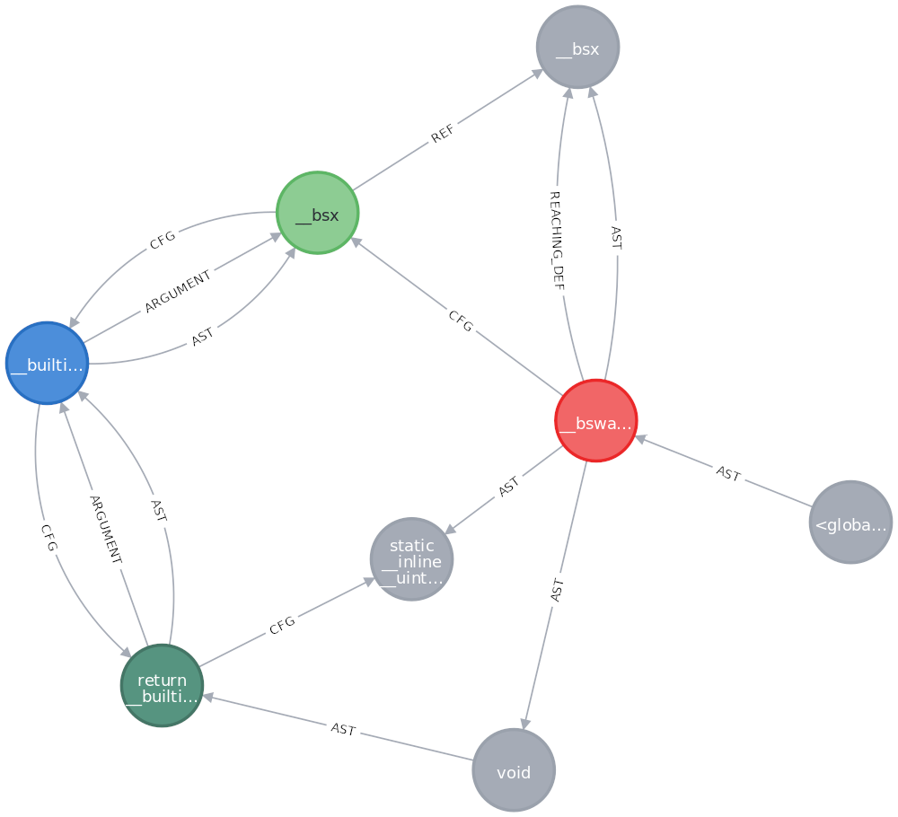

# joernCpgExport
Export ShiftLeft Code Property Graph (cpg) from OverflowDB to json and csv.
The csv can be imported into the Neo4j graph database.
Neo4j can be used to visualize the graph and to write queries via cypher.

**Please note:** The OverflowDB file format is not compatible between different versions.
Be sure to use the same OverflowDB version in joern and joernCpgExport.

Reference:
* https://github.com/ShiftLeftSecurity/codepropertygraph
* https://github.com/ShiftLeftSecurity/joern/
* https://github.com/ShiftLeftSecurity/overflowdb
* https://neo4j.com/

## Build
```shell
$ sbt stage
```

## Usage
```shell
$ ./target/universal/stage/bin/joernCpgExport --help
Usage: joernCpgExport [options]

  -d, --no-default-overlays  do not apply default overlays
  -o, --no-oss-dataflow      do not apply oss dataflow overlay
  -c, --cpg <cpg.bin>        load cpg from OverflowDB
  -j, --json <cpg.json>      export cpg as json file
  --help                     prints this usage text
```

## Example
```shell
# use fuzzyc2cpg from joern to parse source code and create OverflowDB
$ fuzzyc2cpg.sh --output cpg.bin src
# convert OverflowDB into json
$ joernCpgExport --cpg cpg.bin --json cpg.json
```

cpg.json:
```json
{
  "nodes" : [ {
    "ID" : 1,
    "OVERLAYS" : [ "semanticcpg", "dataflowOss" ],
    "VERSION" : "0.1",
    "LANGUAGE" : "C",
    "TYPE" : "META_DATA"
  }, {
    "ID" : 2,
    "FULL_NAME" : "<global>",
    "ORDER" : 1,
    "TYPE" : "NAMESPACE_BLOCK",
    "NAME" : "<global>",
    "FILENAME" : "<unknown>"
  }, {
    "ID" : 100,
    "TYPE_DECL_FULL_NAME" : "",
    "NAME" : "",
    "FULL_NAME" : "",
    "TYPE" : "TYPE"
  }, {
    "ID" : 101,
    "TYPE_DECL_FULL_NAME" : " [ 1 ]",
    "NAME" : " [ 1 ]",
    "FULL_NAME" : " [ 1 ]",
    "TYPE" : "TYPE"
  },
  [...]
  ]
}
```

## Convert json to csv
You can convert the json file into csv, grouped by node type.
The csv files can be imported into Neo4j via bulk import.
The csv files will be created in the `csv` subfolder of the basedir of the provided `cpg.json`.
Existing files will be overwritten.
```shell
# we need pandas as dependency
$ pip3 install --user pandas
$ scripts/joern-json-csv.py <cpg.json>
```
csv/edge.csv:
```csv
:END_ID,:START_ID,:TYPE,VARIABLE
1024809,1313,REF,
1154373,1314,REF,
1024810,1315,REF,
1154374,1316,REF,
1030528,1317,REF,
1154375,1318,REF,
1024811,1319,REF,
1154376,1320,REF,
1154377,1321,REF,
1154378,1322,REF,
1154379,1323,REF,
```

## Import into Neo4j
Neo4j offers two methods to import csv data: 1) via cypher `LOAD CSV` command and 2) via the `neo4j-admin` command.
For (1) you need first to create the graph model. Data types of the csv columns must be explicitly converted during loading.
For (2) the database must be empty (delete all nodes and relations seems not to be sufficient). Data types are detected automatically, or via column header.
See also: https://neo4j.com/developer/guide-import-csv/

Neo4j commands:
```shell
# stop Neo4j service
$ neo4j stop
# delete database
$ rm -rf data
# set Neo4j admin password
$ neo4j-admin set-initial-password <password>
# batch import
$ neo4j-admin import --multiline-fields=true --quote=\" --relationships=csv/edge.csv --nodes=csv/vertex_BLOCK.csv --nodes=csv/vertex_CALL.csv ...
# start Neo4j service
$ neo4j start
```

Cpg viewed via Neo4j web UI:

